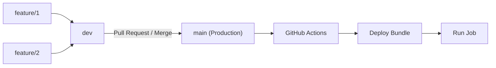
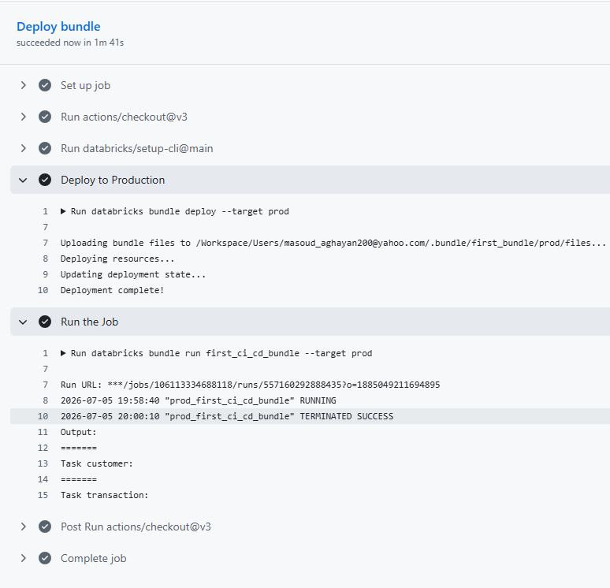

# Databricks Asset Bundles CI/CD

Practicing CI/CD for Databricks using Databricks Asset Bundles (DABs) with GitHub Actions.

---

## Overview

This repository implements a fully automated CI/CD pipeline for Databricks. By leveraging **Databricks Asset Bundles (DABs)**, we treat our Databricks resources (jobs, notebooks, and configurations) as infrastructure-as-code.  

The pipeline is triggered automatically whenever a Pull Request is **merged from the `dev` branch into the `main` (production) branch**. It deploys the updated bundle to the production workspace and immediately starts the production job—ensuring a seamless, hands-off release process.

---

## Git Branching Strategy

We follow a simple three-tier branching model to maintain a clean separation between development and production:

* **`feature/*` branches**: For isolated feature development, bug fixes, and experimentation.
* **`dev` branch**: The integration branch where multiple features are merged and tested together.
* **`main` branch** (Production): The source of truth for production workloads. Only merges from `dev` trigger the automated deployment.



---

## Project Structure

The repository is organized to keep the bundle configuration separate from the CI/CD logic:

```text
├── .github/
│   └── workflows/
│       └── production_deployment.yml   # GitHub Actions workflow for CI/CD
├── first_bundle/                       # Databricks Asset Bundle
│   ├── databricks.yml                  # Main configuration (targets, variables, permissions)
│   └── resources/                      # YAML definitions for Jobs and other assets
├── image/
│   └── proof.png                       # Screenshot of successful pipeline execution
└── README.md                           # This file
```

---

## CI/CD Pipeline (GitHub Actions)

The pipeline is defined in `.github/workflows/production_deployment.yml`.

### Trigger Conditions
* **Branch:** `main` (production)
* **Path filter:** Only runs if changes are detected inside the `first_bundle/` folder. This prevents unnecessary runs for documentation or root-level updates.

### Workflow Steps
1. **Checkout:** Fetches the latest code from the repository.
2. **Setup CLI:** Installs the Databricks CLI.
3. **Deploy to Production:** Runs `databricks bundle deploy --target prod` to sync the bundle and update the job definition.
4. **Run the Job:** Runs `databricks bundle run first_ci_cd_bundle --target prod` to start the production job immediately after deployment.

### Environment & Secrets
The following secrets must be configured in your GitHub repository settings (**Settings** → **Secrets and variables** → **Actions**):

| Secret Name | Description |
| :--- | :--- |
| `DATABRICKS_HOST` | Your Databricks workspace URL (e.g., `https://dbc-760e4c37-d0a0.cloud.databricks.com`) |
| `SP_TOKEN` | Databricks Personal Access Token (PAT) or Service Principal token. |

---

## Databricks Bundle Targets

The `databricks.yml` file defines two distinct targets to separate environments:

| Target | Mode | Naming Prefix | Purpose |
| :--- | :--- | :--- | :--- |
| **dev** | Default | `dev_` | Development testing & validation |
| **prod** | Production | `prod_` | Production workloads |

> [!NOTE]
> The job resource key used in the run command is `first_ci_cd_bundle`, as defined in the `resources/` folder.

---

## Proof of Success

Below is a screenshot of a successful pipeline execution triggered by a merged pull request from `dev` to `main`:



The logs confirm:
* ✅ **Bundle deployed successfully.**
* ✅ **Production job executed and terminated with SUCCESS.**